# Setowire - Technical Specification

## 1. Project Overview

| Property | Value |
|---|---|
| **Name** | Setowire |
| **Version** | 0.1.1 |
| **License** | MIT |
| **Runtime** | Node.js >= 18 |
| **Transport** | UDP |
| **Architecture** | Peer-to-Peer, Serverless |

Setowire is a lightweight, portable P2P networking library built on UDP. It enables direct peer-to-peer communication without central servers or brokers. Peers discover each other through multiple parallel strategies and communicate with end-to-end encryption.

---

## 2. High-Level Architecture

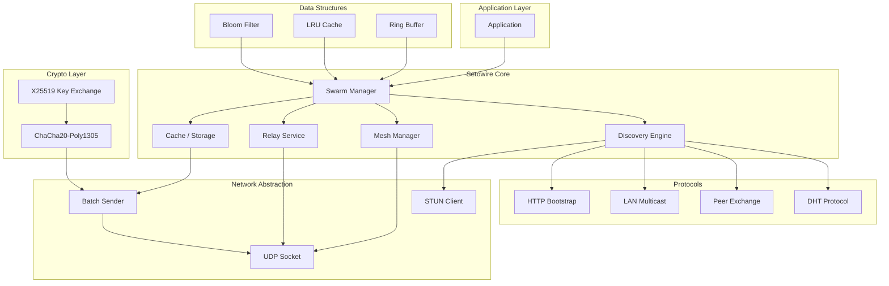

### 2.1 Core Components

| Component | File | Responsibility |
|---|---|---|
| **Swarm** | `swarm.js` | Main API, peer management, event emission |
| **Peer** | `peer.js` | Per-peer state, queues, congestion control |
| **Cryptography** | `crypto.js` | Key exchange, encryption, decryption |
| **DHT** | `dht_lib.js` | Decentralized topic discovery |
| **Framing** | `framing.js` | Fragmentation, batching, jitter buffer |
| **Structures** | `structs.js` | Bloom filter, LRU, ring buffer |
| **Constants** | `constants.js` | All tuneable parameters |

---

## 3. Module Architecture

### 3.1 Swarm Class

The `Swarm` class is the main entry point, managing all P2P operations.

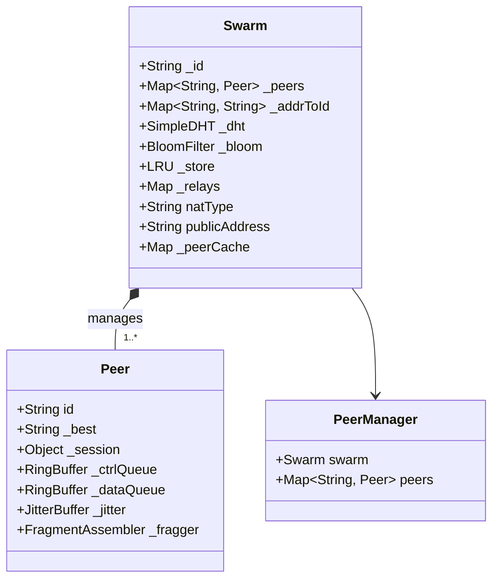

### 3.2 Discovery Pipeline

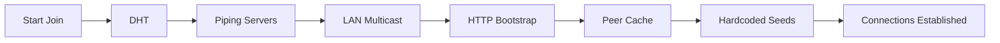

Discovery strategies run in parallel; whichever succeeds first establishes the connection.

---

## 4. Network Protocol

### 4.1 Frame Types

| Byte | Type | Description | Direction |
|---|---|---|---|
| `0x01` | DATA | Encrypted application data | Bidirectional |
| `0x03` | PING | Keepalive + RTT measurement | Outbound |
| `0x04` | PONG | Keepalive reply | Inbound |
| `0x0A` | GOAWAY | Graceful disconnect | Bidirectional |
| `0x0B` | FRAG | Fragment of large message | Bidirectional |
| `0x13` | BATCH | Multiple frames in one datagram | Bidirectional |
| `0x14` | CHUNK_ACK | ACK for reliable chunk transfer | Bidirectional |
| `0x20` | RELAY_ANN | Peer announces as relay | Outbound |
| `0x21` | RELAY_REQ | Request introduction via relay | Outbound |
| `0x22` | RELAY_FWD | Relay forwards introduction | Inbound |
| `0x30` | PEX | Peer exchange | Bidirectional |
| `0x09` | LAN | LAN multicast discovery | Outbound |
| `0xA1` | HELLO | Handshake: initial | Outbound |
| `0xA2` | HELLO_ACK | Handshake: response | Inbound |
| `0x10` | HAVE | Announce available keys | Outbound |
| `0x11` | WANT | Request specific key | Outbound |
| `0x12` | CHUNK | Key value chunk | Bidirectional |

### 4.2 Handshake Protocol

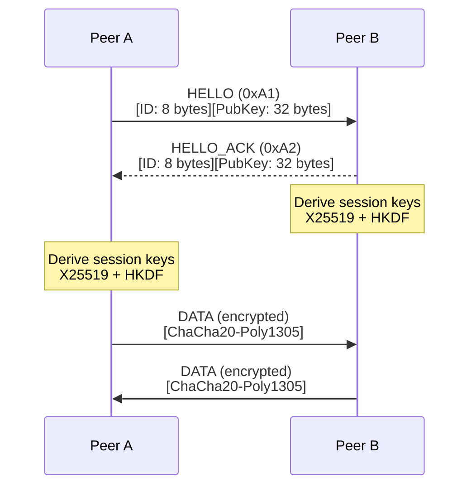

The handshake uses X25519 key exchange. Both peers derive session keys using HKDF-SHA256 with label `p2p-v12-session`. The peer with the lexicographically lower ID uses the first 32 bytes as send key; the other peer flips them.

### 4.3 Packet Structure

```
┌─────────────────────────────────────────────────────────────┐
│ Frame Type (1 byte) │ Payload (variable)                   │
└─────────────────────────────────────────────────────────────┘
```

```
HELLO Frame (0xA1):
┌────────┬──────────────────┬────────────────────────────┐
│ 0xA1   │ Peer ID (8 bytes)  │ X25519 Public Key (32 bytes)  │
└────────┴──────────────────┴────────────────────────────┘

DATA Frame (0x01) - Encrypted:
┌────────┬─────────────────────────┬──────────────────────────┐
│ 0x01   │ Nonce (12 bytes)          │ Ciphertext + Tag (28+ N) │
└────────┴─────────────────────────┴──────────────────────────┘
```

---

## 5. Data Flow Architecture

### 5.1 Message Processing Pipeline


### 5.2 Reliable Chunk Transfer

For values larger than 900 bytes, a sliding window protocol ensures delivery:

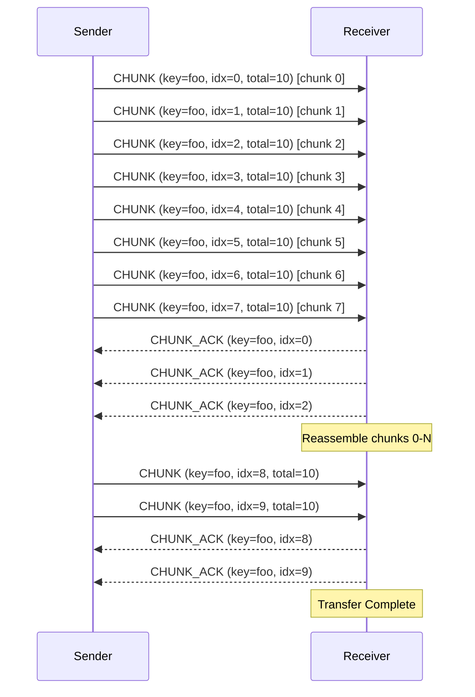

Parameters:
- **Window Size**: 8 chunks
- **Chunk Size**: 900 bytes
- **RTO**: 1500ms (retransmit timeout)
- **Safety Timeout**: 60 seconds

---

## 6. NAT Traversal

### 6.1 NAT Type Detection

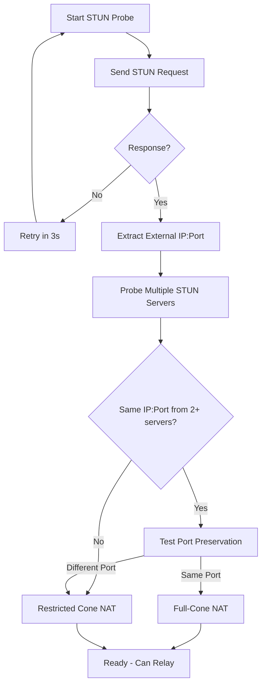

### 6.2 Relay Mechanism

Peers with full-cone NAT automatically become relays for others:

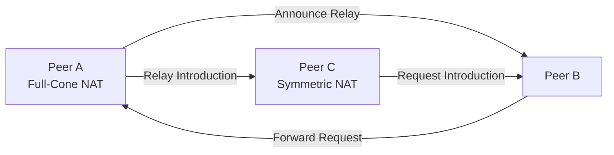

---

## 7. Mesh Management

### 7.1 Flooding Mesh

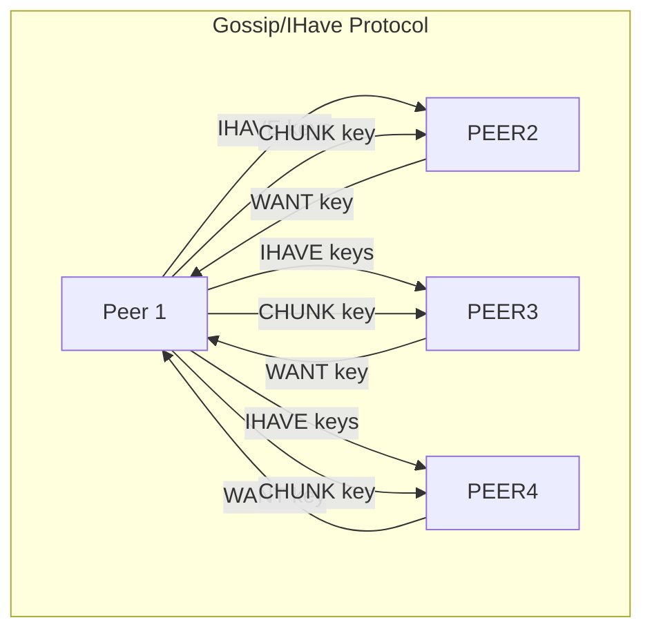

### 7.2 Mesh Degree Adaptation

The mesh degree (D) adapts based on RTT:

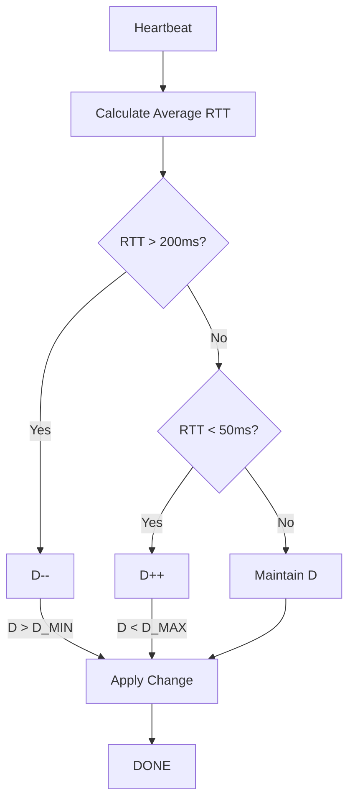

Mesh parameters:
- **Default Degree (D_DEFAULT)**: 6
- **Minimum Degree (D_MIN)**: 4
- **Maximum Degree (D_MAX)**: 16
- **Low Threshold (D_LOW)**: 4
- **High Threshold (D_HIGH)**: 16

---

## 8. Cryptography

### 8.1 Key Derivation

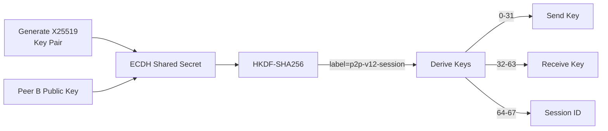

### 8.2 Encryption

```
Algorithm: ChaCha20-Poly1305
Key: 32 bytes
Nonce: 12 bytes (4-byte session ID + 8-byte counter)
Auth Tag: 16 bytes
```

---

## 9. Data Structures

### 9.1 Bloom Filter

Used for duplicate detection in message flooding:

- **Size**: 64 megabits
- **Hash Functions**: 5
- **Rotation Interval**: 5 minutes

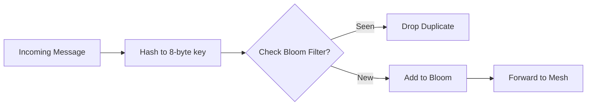

### 9.2 LRU Cache

Used for key-value storage:

- **Default Size**: 10,000 entries
- **TTL**: Configurable (default: infinity for storage, 30s for gossip)

### 9.3 Ring Buffer

Used for per-peer send queues:

- **Control Queue**: 256 items
- **Data Queue**: 2048 items
- **Size**: Power of 2

---

## 10. Component Interactions

### 10.1 Peer State Machine

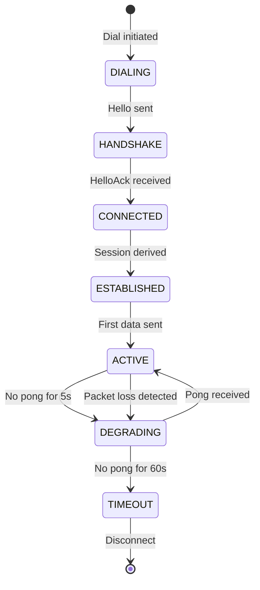

### 10.2 Congestion Control

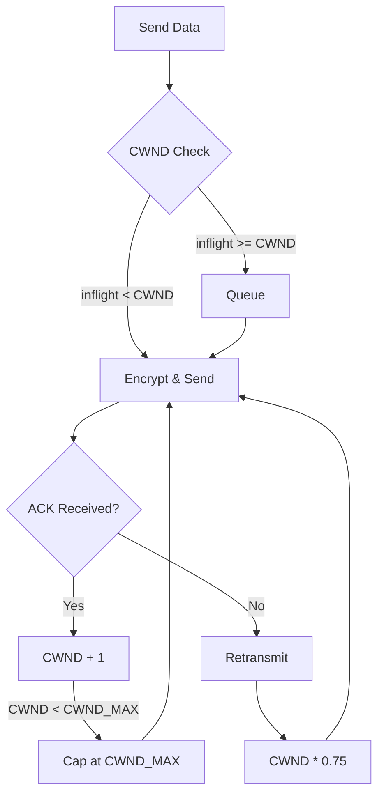

---

## 11. API Architecture

### 11.1 Class Diagram

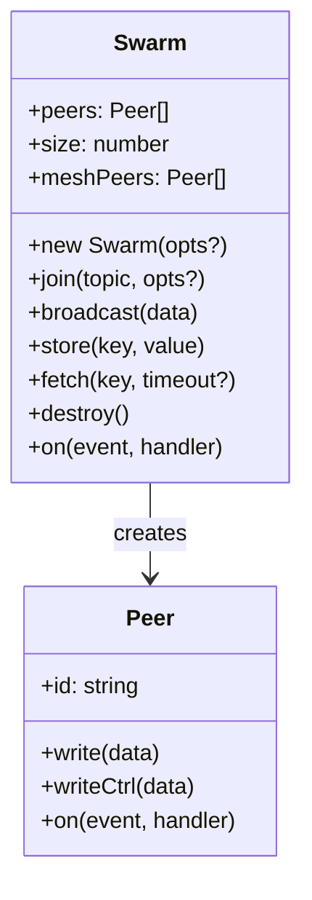

### 11.2 Events

| Event | Arguments | Description |
|---|---|---|
| `connection` | `peer, info` | New peer connected |
| `data` | `data, peer` | Message received |
| `disconnect` | `peerId` | Peer disconnected |
| `sync` | `key, value` | Value received from network |
| `nat` | — | Public address discovered |
| `nattype` | — | NAT type determined |
| `peers` | `peers[]` | Peer cache updated |
| `close` | — | Swarm destroyed |

---

## 12. Storage Backend

### 12.1 Interface

```typescript
interface StorageBackend {
  get(key: string): Promise<Buffer | null>;
  set(key: string, value: Buffer): Promise<void>;
}
```

### 12.2 Supported Backends

- **LevelDB** (`level` package)
- **SQLite** (`better-sqlite3`)
- **JSON file** (simple key-value)
- **Custom** (any async key-value store)

---

## 13. Constants Reference

### 13.1 Network

| Constant | Default | Description |
|---|---|---|
| `MAX_PEERS` | 100 | Maximum simultaneous connections |
| `MAX_PAYLOAD` | 1200 | Maximum payload size (bytes) |
| `BATCH_MTU` | 1400 | Batch MTU threshold |
| `PEER_TIMEOUT` | 60000 | Peer timeout (ms) |
| `HEARTBEAT_MS` | 1000 | Heartbeat interval (ms) |

### 13.2 Discovery

| Constant | Default | Description |
|---|---|---|
| `PUNCH_TRIES` | 8 | UDP punch attempts |
| `PUNCH_INTERVAL` | 300 | Punch interval (ms) |
| `ANNOUNCE_MS` | 18000 | Announcement interval (ms) |
| `BOOTSTRAP_TIMEOUT` | 15000 | Bootstrap fallback delay (ms) |

### 13.3 Relay

| Constant | Default | Description |
|---|---|---|
| `RELAY_MAX` | 20 | Maximum relays to track |
| `RELAY_ANN_MS` | 30000 | Relay announcement interval |
| `RELAY_BAN_MS` | 300000 | Relay ban duration |

### 13.4 Sync

| Constant | Default | Description |
|---|---|---|
| `SYNC_CHUNK_SIZE` | 900 | Chunk size for reliable transfer |
| `SYNC_TIMEOUT` | 30000 | Fetch timeout (ms) |
| `SYNC_CACHE_MAX` | 10000 | Cache size |
| `HAVE_BATCH` | 64 | HAVE batch size |

### 13.5 Congestion Control

| Constant | Default | Description |
|---|---|---|
| `CWND_INIT` | 16 | Initial congestion window |
| `CWND_MAX` | 512 | Maximum congestion window |
| `CWND_DECAY` | 0.75 | Window decay factor |
| `RATE_PER_SEC` | 128 | Token bucket rate |
| `RATE_BURST` | 256 | Token bucket burst |

### 13.6 Protocol Frames

| Constant | Value | Description |
|---|---|---|
| `F_DATA` | 0x01 | Encrypted data |
| `F_PING` | 0x03 | Keepalive request |
| `F_PONG` | 0x04 | Keepalive response |
| `F_FRAG` | 0x0B | Fragmented message |
| `F_GOAWAY` | 0x0A | Disconnect |
| `F_BATCH` | 0x13 | Batch multiple frames |
| `F_HAVE` | 0x10 | Announce available keys |
| `F_WANT` | 0x11 | Request specific key |
| `F_CHUNK` | 0x12 | Key value chunk |
| `F_CHUNK_ACK` | 0x14 | Chunk acknowledgment |
| `F_RELAY_ANN` | 0x20 | Relay announcement |
| `F_RELAY_REQ` | 0x21 | Relay introduction request |
| `F_RELAY_FWD` | 0x22 | Relay introduction forward |
| `F_PEX` | 0x30 | Peer exchange |
| `F_LAN` | 0x09 | LAN multicast |

---

## 14. Extension Points

### 14.1 Custom Storage

```javascript
const swarm = new Swarm({
  storage: {
    get: async (key) => { /* ... */ },
    set: async (key, value) => { /* ... */ },
  },
});
```

### 14.2 Custom Bootstrap

```javascript
const swarm = new Swarm({
  bootstrap: ['bootstrap1.example.com:49737'],
  seeds: ['seed1.example.com:49737'],
  bootstrapHttp: ['https://bootstrap.example.com'],
});
```

### 14.3 Peer Cache Callbacks

```javascript
const swarm = new Swarm({
  onSavePeers: (peers) => saveToFile(peers),
  onLoadPeers: () => loadFromFile(),
});
```

---

## 15. Porting to Other Languages

### 15.1 Minimum Required Implementation

To port to another language, implement:

1. **X25519 key exchange** + HKDF-SHA256 to derive send/recv keys
2. **ChaCha20-Poly1305** encrypt/decrypt with 12-byte nonce (4-byte session ID + 8-byte counter)
3. **Handshake frames** (`0xA1` / `0xA2`)
4. **DATA frame** (`0x01`) with encrypted payload
5. **PING/PONG** for keepalive

### 15.2 Optional Extensions

Everything else is optional and can be added incrementally:

- DHT for decentralized discovery
- Relay for NAT traversal
- PEX for peer exchange
- Gossip for key propagation
- Reliable chunk transfer

---

## 16. File Structure

```
setowire/
├── index.js       # Entry point (exports Swarm)
├── swarm.js      # Main Swarm class (1318 lines)
├── peer.js       # Per-peer state (207 lines)
├── crypto.js     # X25519 + ChaCha20-Poly1305 (65 lines)
├── dht_lib.js    # Minimal DHT implementation (365 lines)
├── framing.js    # Fragmentation, batching (161 lines)
├── structs.js     # BloomFilter, LRU, RingBuffer (139 lines)
├── constants.js  # All tuneable parameters (140 lines)
├── chat.js       # Example terminal chat app
├── package.json  # Package manifest
└── README.md     # User documentation
```

---

## 17. Execution Flow (Startup)

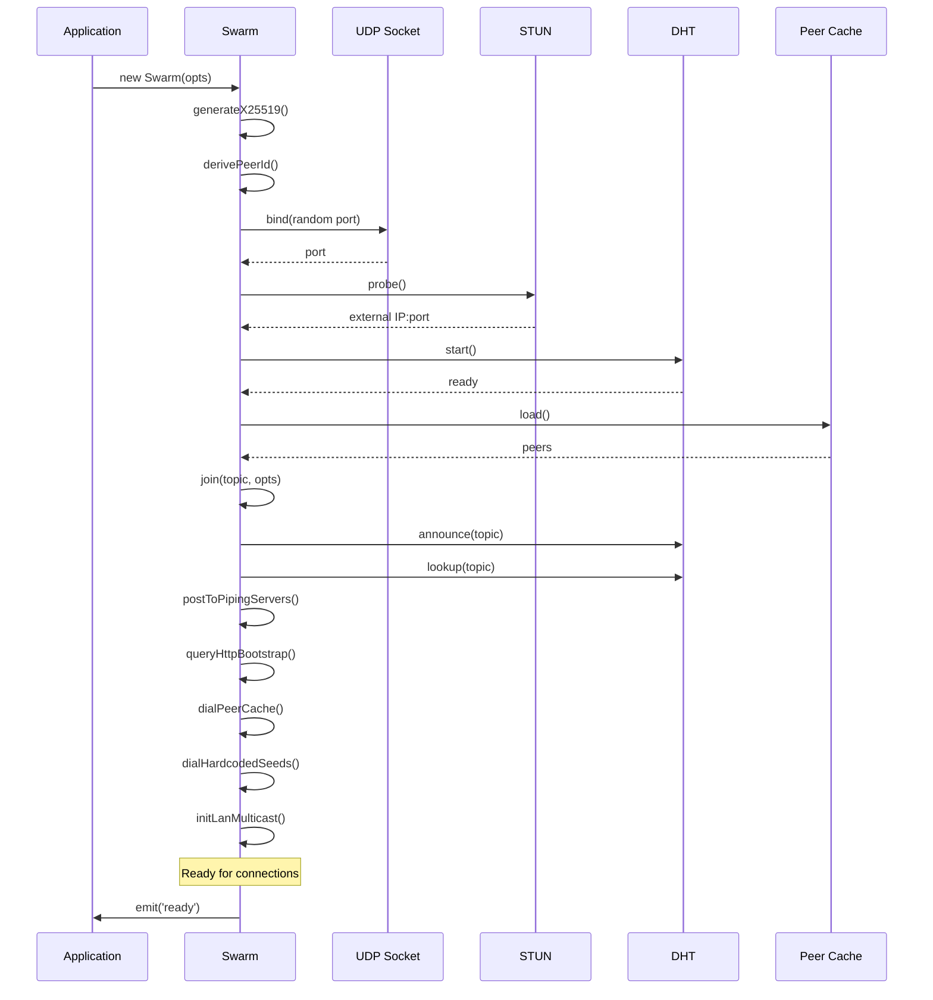

---

## 18. Security Considerations

### 18.1 Encryption

- **Key Exchange**: X25519 (Elliptic Curve Diffie-Hellman)
- **Symmetric Encryption**: ChaCha20-Poly1305
- **Key Derivation**: HKDF-SHA256 with fixed label

### 18.2 Denial of Service Mitigation

- Maximum peer limit (`maxPeers`)
- Per-peer address limit (`MAX_ADDRS_PEER`)
- Relay ban mechanism (`RELAY_BAN_MS`)
- Token bucket rate limiting

### 18.3 Relay Security

- Relays can be banned after failures
- Relay announcement interval limits abuse

---

## 19. Performance Characteristics

### 19.1 Latency

- **Handshake**: 1-2 RTTs (typically 50-500ms)
- **Message delivery**: ~1 RTT for direct peers
- **NAT traversal**: +0-3 seconds for first connection

### 19.2 Throughput

- **Per peer**: Token bucket (128 tokens/sec, burst 256)
- **Congestion window**: 16-512 packets
- **Batch sender**: 1400 byte MTU

### 19.3 Memory

- **Per peer**: ~2KB (queues, state)
- **Bloom filter**: 8MB
- **LRU cache**: 10,000 entries

---

## 20. Error Handling

### 20.1 Connection Failures

- NAT traversal failure → Try relay
- Relay failure → Ban and select alternative
- All strategies fail → Emit `disconnect` event

### 20.2 Storage Errors

- Storage backend errors → Silently ignored
- Data fetched from network instead

### 20.3 Network Errors

- Socket errors → Logged and recovered
- Invalid frames → Dropped silently

---

## Appendix A: Protocol Buffer Formats

### A.1 HELLO (0xA1)

```
Offset  Size    Field
0       1       Frame type (0xA1)
1       8       Peer ID (20-byte SHA-256 truncated)
9       32      X25519 public key
```

### A.2 DATA (0x01) - Encrypted

```
Offset  Size    Field
0       1       Frame type (0x01)
1       12      Nonce (session ID + counter)
13      N       Ciphertext
13+N    16      Auth tag
```

### A.3 FRAG (0x0B)

```
Offset  Size    Field
0       1       Frame type (0x0B)
1       8       Fragment ID (random)
9       2       Fragment index
11      2       Total fragments
13      N       Fragment data
```

### A.4 BATCH (0x13)

```
Offset  Size    Field
0       1       Frame type (0x13)
1       1       Frame count
2       2       Frame 1 length
4       L1      Frame 1 data
4+L1    2       Frame 2 length
...     ...     ...
```

---

## Appendix B: Configuration Example

```javascript
const Swarm = require('setowire');

const swarm = new Swarm({
  seed: 'my-deterministic-seed-hex',
  maxPeers: 100,
  relay: false,
  bootstrap: [
    'bootstrap1.example.com:49737',
    'bootstrap2.example.com:49737',
  ],
  seeds: [
    'seed1.example.com:49737',
  ],
  storage: {
    get: async (key) => { /* ... */ },
    set: async (key, value) => { /* ... */ },
  },
  storeCacheMax: 10000,
  onSavePeers: (peers) => { /* ... */ },
  onLoadPeers: () => { /* ... */ },
});

const topic = Buffer.from('my-topic');

swarm.join(topic, { announce: true, lookup: true });

swarm.on('connection', (peer) => {
  console.log('New peer:', peer.id);
  peer.write(Buffer.from('Hello!'));
});

swarm.on('data', (data, peer) => {
  console.log('Received:', data.toString());
});

swarm.on('disconnect', (peerId) => {
  console.log('Peer disconnected:', peerId);
});
```

---

*End of Specification*