# Setowire - Technical Specification

## 1. Project Overview

| Property | Value |
|---|---|
| **Name** | Setowire |
| **Version** | 0.1.1 |
| **License** | MIT |
| **Runtime** | Node.js >= 18 |
| **Transport** | UDP |
| **Architecture** | Peer-to-Peer, Serverless |

Setowire is a lightweight, portable P2P networking library built on UDP. It enables direct peer-to-peer communication without central servers or brokers. Peers discover each other through multiple parallel strategies and communicate with end-to-end encryption.

---

## 2. High-Level Architecture

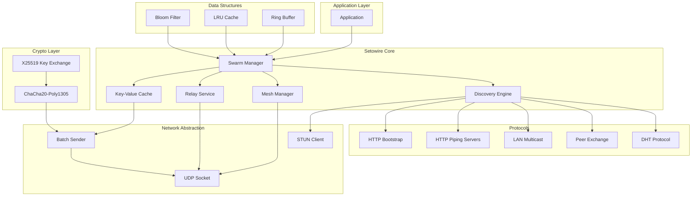

### 2.1 Core Components

| Component | File | Responsibility |
|---|---|---|
| **Swarm** | `swarm.js` | Main API, peer management, event emission |
| **Peer** | `peer.js` | Per-peer state, queues, congestion control |
| **Cryptography** | `crypto.js` | Key exchange, encryption, decryption |
| **DHT** | `dht_lib.js` | Decentralized topic discovery |
| **Framing** | `framing.js` | Fragmentation, batching, jitter buffer |
| **Structures** | `structs.js` | Bloom filter, LRU, ring buffer, payload cache |
| **Constants** | `constants.js` | All tuneable parameters |

---

## 3. Module Architecture

### 3.1 Swarm Class

The `Swarm` class is the main entry point, managing all P2P operations.

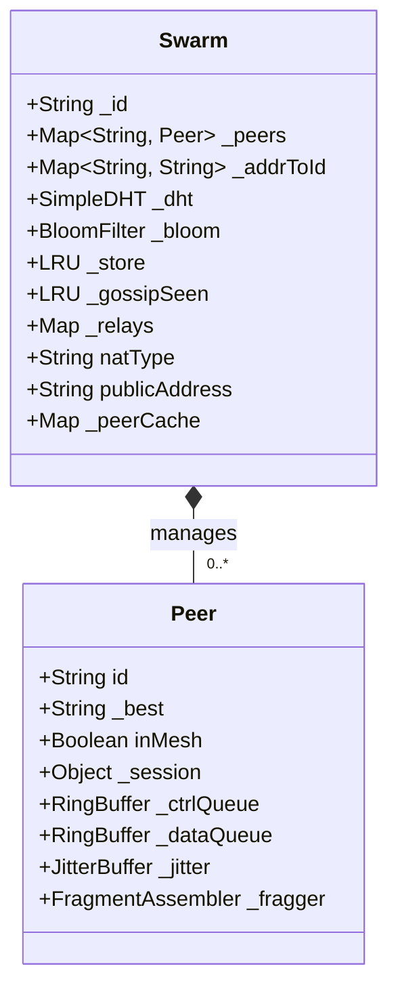

### 3.2 Discovery Pipeline

O discovery acontece em TWO fases distintas:

1. **Constructor (_init)**: LAN multicast, PEX, STUN, peer cache emit - iniciados automaticamente
2. **join()**: DHT, HTTP Piping, HTTP Bootstrap, Seeds, Peer Cache dial - iniciados após NAT descoberta

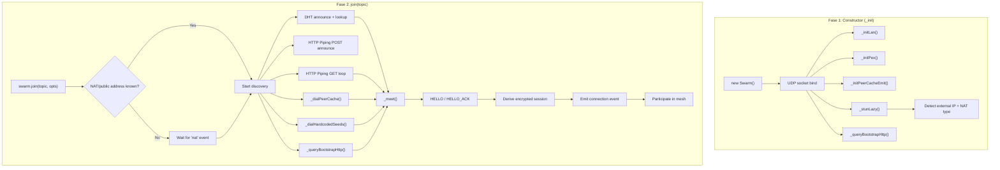

Fluxo REAL (baseado em swarm.js linhas 139-306):

1. No **`new Swarm()`** → `_init()` (linha 342) inicializa:
   - `_stunLazy()` - detecta IP externo e NAT
   - `_initLan()` - multicast UDP para LAN
   - `_initPex()` - peer exchange interval
   - `_initPeerCacheEmit()` - cache emit interval
   - `_queryBootstrapHttp()` - HTTP bootstrap query

2. Em **`swarm.join(topic, opts)`** → após NAT descoberto:
   - `startDHT()` - announces/lookups no DHT
   - `_dialPeerCache()` - disca peers em cache
   - `_dialHardcodedSeeds()` - disca seeds
   - `_queryBootstrapHttp()` - HTTP bootstrap
   - `postAll()` - HTTP piping POST (announce)
   - `pipingGet()` - HTTP piping GET loops (lookup)

---

## 4. Network Protocol

### 4.1 Frame Types

| Byte | Type | Description | Direction |
|---|---|---|---|
| `0x01` | DATA | Encrypted application data | Bidirectional |
| `0x03` | PING | Keepalive + RTT measurement | Outbound |
| `0x04` | PONG | Keepalive reply | Inbound |
| `0x07` | IHAVE | Gossip: have keys | Outbound |
| `0x09` | LAN | LAN multicast discovery | Outbound (broadcast) |
| `0x0A` | GOAWAY | Graceful disconnect | Bidirectional |
| `0x0B` | FRAG | Fragment of large message | Bidirectional |
| `0x10` | HAVE | Announce available keys (DHT value) | Outbound |
| `0x11` | WANT | Request specific key | Outbound |
| `0x12` | CHUNK | Key value chunk | Bidirectional |
| `0x13` | BATCH | Multiple frames in one datagram | Bidirectional |
| `0x14` | CHUNK_ACK | ACK for reliable chunk transfer | Bidirectional |
| `0x20` | RELAY_ANN | Peer announces as relay | Outbound |
| `0x21` | RELAY_REQ | Request introduction via relay | Outbound |
| `0x22` | RELAY_FWD | Relay forwards introduction | Inbound |
| `0x30` | PEX | Peer exchange | Bidirectional |
| `0xA1` | HELLO | Handshake: initial (not encrypted) | Outbound |
| `0xA2` | HELLO_ACK | Handshake: response (not encrypted) | Inbound |

> **Note**: HELLO (0xA1) and HELLO_ACK (0xA2) are NOT defined in constants.js - they use hardcoded values 0xA1 and 0xA2 directly in the code (swarm.js lines 488, 497).

### 4.2 Handshake Protocol

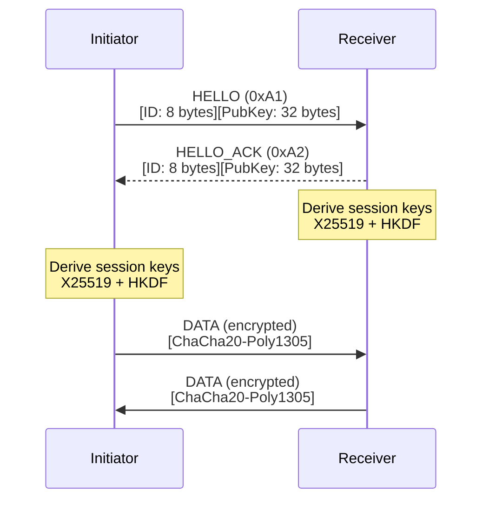

The handshake uses X25519 key exchange (NOT in constants - defined inline). Both peers derive session keys using HKDF-SHA256 with label `p2p-v12-session`. The peer with the lexicographically lower ID uses the first 32 bytes as send key; the other peer flips them.

### 4.3 Packet Structures

All frames start with 1-byte type:

```
┌─────────────────────────────────────────────────────────────┐
│ Frame Type (1 byte) │ Payload (variable)                   │
└─────────────────────────────────────────────────────────────┘
```

**HELLO Frame (0xA1) - NOT in constants, hardcoded:**

```
Offset  Size     Field                    Notes
0       1        Frame type (0xA1)
1       8        Peer ID (hex string, 20 bytes → 8 bytes in frame)
9       32       X25519 public key (raw)
Total: 41 bytes
```

> **CORRECTION**: Peer ID is 20 bytes in `this._id`, but only 8 bytes are sent in the HELLO frame (swarm.js line 486-490: `Buffer.from(this._id, 'hex')` creates a 20-byte buffer, but only 8 bytes are allocated in the frame).

**DATA Frame (0x01) - Encrypted:**

```
Offset  Size     Field
0       1        Frame type (0x01)
1       12       Nonce (4-byte session ID + 8-byte counter)
13      N        Ciphertext
13+N    16       Auth tag (Poly1305)
Total: 13 + N + 16 bytes
```

**FRAG Frame (0x0B):**

```
Offset  Size     Field
0       1        Frame type (0x0B)
1       8        Fragment ID (random)
9       2        Fragment index
11      2        Total fragments
13      N        Fragment data
Total: 13 + N bytes
```

**BATCH Frame (0x13):**

```
Offset  Size     Field
0       1        Frame type (0x13)
1       1        Frame count
2       2        Frame 1 length (uint16)
4       L1       Frame 1 data
4+L1    2        Frame 2 length
...     ...       ...
```

**IHAVE Frame (0x07):**

Used for gossip (swarm.js `_emitIhave` line 1269):

```
Offset  Size     Field
0       1        Frame type (0x07)
1       N        Concatenated key hashes (8 bytes each)
```

---

## 5. Data Flow Architecture

### 5.1 Message Processing Pipeline

```mermaid
flowchart TB

    subgraph "Outbound Path"

        APP_WRITE["peer.write(data)"]

        APP_WRITE --> DATA_QUEUE["Peer _dataQueue"]

        DATA_QUEUE --> SIZE_CHECK{"Payload > MAX_PAYLOAD?"}

        SIZE_CHECK -->|Yes| FRAGMENT["Create FRAG frames"]
        SIZE_CHECK -->|No| ENCRYPT["Encrypt DATA frame"]

        FRAGMENT --> ENCRYPT

        ENCRYPT --> NONCE["Build nonce<br/>session_id + counter"]

        NONCE --> CHACHA["ChaCha20-Poly1305"]

        CHACHA --> FRAME["Build DATA frame (0x01)"]

        FRAME --> BATCHER["BatchSender"]

        BATCHER --> UDP_SEND["UDP socket send"]
    end


    subgraph "Inbound Path"

        UDP_RECV["UDP socket receive"]

        UDP_RECV --> DISPATCH["Frame dispatcher"]

        DISPATCH --> TYPE_CHECK{"Frame type"}

        TYPE_CHECK -->|HELLO/HELLO_ACK| HANDSHAKE["Handshake processing"]

        TYPE_CHECK -->|DATA| DECRYPT["Decrypt frame"]

        TYPE_CHECK -->|FRAG| REASSEMBLE["Fragment assembler"]

        TYPE_CHECK -->|BATCH| UNPACK["Unpack batched frames"]

        UNPACK --> DISPATCH

        HANDSHAKE --> SESSION_CREATE["Create encrypted session"]

        DECRYPT --> AUTH{"Poly1305 valid?"}

        AUTH -->|No| DROP["Drop frame"]

        AUTH -->|Yes| SEQ_CHECK{"Sequenced?"}

        SEQ_CHECK -->|Yes| JITTER["JitterBuffer"]

        SEQ_CHECK -->|No| EMIT_DIRECT["Emit peer/data event"]

        JITTER --> ORDERED["Deliver ordered packets"]

        ORDERED --> EMIT_ORDERED["Emit peer/data event"]

        REASSEMBLE --> COMPLETE{"All fragments?"}

        COMPLETE -->|No| WAIT["Wait more fragments"]

        COMPLETE -->|Yes| RESTORE["Reassemble payload"]

        RESTORE --> EMIT_DIRECT
    end
```

### 5.2 Reliable Chunk Transfer

For values larger than 900 bytes (SYNC_CHUNK_SIZE), a sliding window protocol ensures delivery:

Parameters:
- **Window Size**: 8 chunks (WINDOW constant in `_onWant`)
- **Chunk Size**: 900 bytes (`SYNC_CHUNK_SIZE`)
- **RTO**: 1500ms (retransmit timeout)
- **Safety Timeout**: 60 seconds (cleanup)

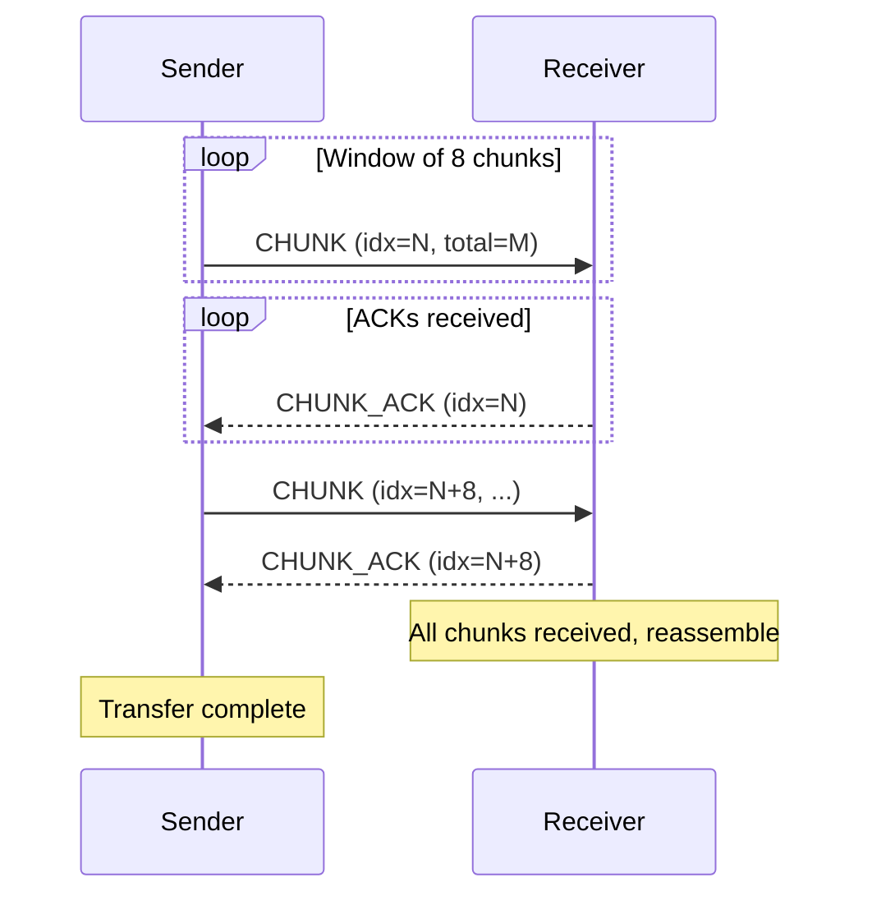

---

## 6. NAT Traversal

### 6.1 STUN Probe

The code uses multiple STUN servers to detect NAT type:

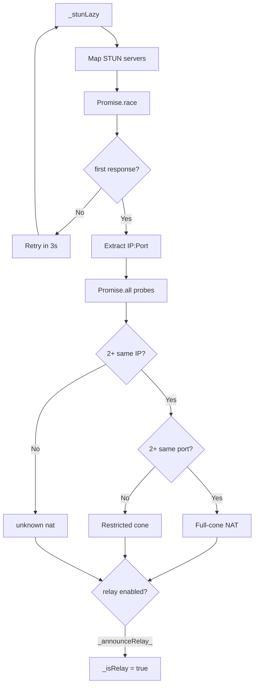

STUN servers used (from constants.js):
- `stun.l.google.com:19302`
- `stun1.l.google.com:19302`
- `stun2.l.google.com:19302`
- `stun.cloudflare.com:3478`
- `stun.stunprotocol.org:3478`
- `global.stun.twilio.com:3478`
- `stun.ekiga.net:3478`

### 6.2 NAT Types Detected

| Type | Detection | Can Relay? |
|---|---|---|
| `full_cone` | Same external IP:Port from 2+ STUN servers | Yes |
| `restricted_cone` | Same IP but different port | No |
| `unknown` | Single response | No |

### 6.3 Relay Mechanism

Peers with full-cone NAT become relays automatically (swarm.js `_checkBecomeRelay`):

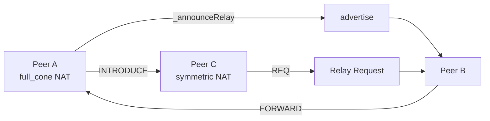

---

## 7. Mesh Management

### 7.1 Mesh Degree

The mesh maintains a target number of "mesh peers" for gossip flooding.

| Constant | Default | Description |
|---|---|---|
| `D_DEFAULT` | 6 | Default mesh degree |
| `D_MIN` | 4 | Minimum mesh degree |
| `D_MAX` | 16 | Maximum mesh degree |
| `D_LOW` | 4 | Low threshold (add peers) |
| `D_HIGH` | 16 | High threshold (remove peers) |

### 7.2 Mesh Adaptation

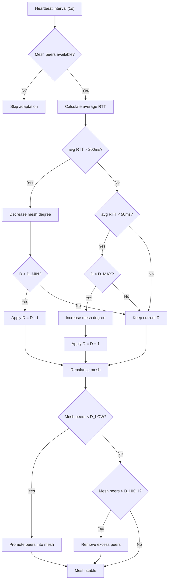

---

## 8. Cryptography

### 8.1 Implementation (NOT in constants.js - inline in crypto.js)

**X25519 Key Generation:**
```javascript
// crypto.js line 19
const { privateKey, publicKey } = crypto.generateKeyPairSync('x25519');
```

**Session Key Derivation:**
```javascript
// crypto.js line 31-33
const derived = Buffer.from(
  crypto.hkdfSync('sha256', shared, Buffer.alloc(0), Buffer.from('p2p-v12-session'), 68)
);
```

**ChaCha20-Poly1305:**
```javascript
// crypto.js line 47
const cipher = crypto.createCipheriv('chacha20-poly1305', sess.sendKey, nonce, { authTagLength: 16 });
```

### 8.2 Key Derivation Flow

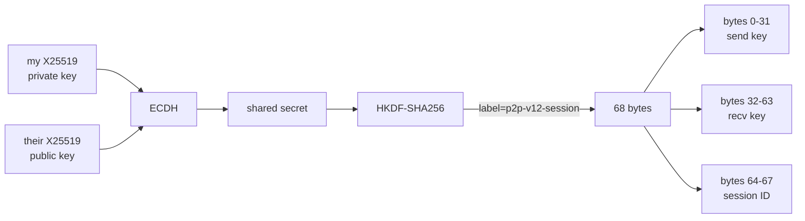

---

## 9. Data Structures

### 9.1 Bloom Filter

Used for duplicate detection in message flooding (line 92 in swarm.js):

- **Size**: `BLOOM_BITS = 64 * 1024 * 1024` = **8,388,608 bits (1 MB)**
- **Hash Functions**: 5
- **Rotation**: Every 5 minutes (`BLOOM_ROTATE`)

> **CORRECTION**: Spec incorrectly said "64 megabits" - actually it's 1 megabyte = 8 megabits

```javascript
// structs.js line 6-12
class BloomFilter {
  constructor(bits, numHashes) {
    this._bits = bits || BLOOM_BITS;  // 8,388,608
    this._hashes = numHashes || 5;
```

### 9.2 LRU Cache

Multiple uses:

- **`_store`**: Key-value cache (swarm.js line 102) - max 10,000 entries
- **`_gossipSeen`**: Gossip deduplication (swarm.js line 94) - 200,000 entries, 30s TTL

### 9.3 Ring Buffer

Per-peer queues (structs.js line 83-111):

- **Control Queue**: 256 items (`QUEUE_CTRL`)
- **Data Queue**: 2048 items (`QUEUE_DATA`)
- **Size**: Must be power of 2

### 9.4 Payload Cache

Caches recent encrypted messages for jitter buffer processing (swarm.js line 100):

```javascript
this._payloadCache = new PayloadCache(8192);
```

---

## 10. Component Interactions

### 10.1 Peer State

States tracked in Peer class:

- `_open`: Connection open (default: `true`)
- `inMesh`: Part of mesh (default: `false`)
- `_seen`: Last activity timestamp
- `_lastPong`: Last pong received timestamp

### 10.2 Congestion Control

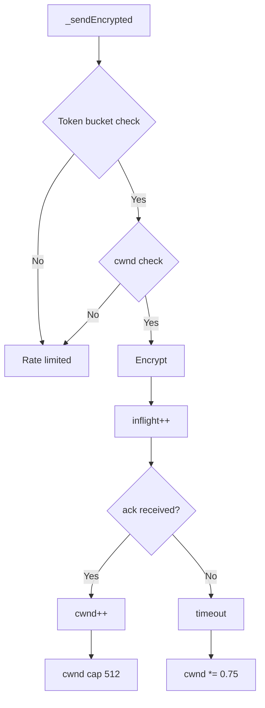

---

## 11. API

### 11.1 Swarm Options

| Option | Default | Type | Description |
|---|---|---|---|
| `seed` | random | string | 32-byte hex for deterministic identity |
| `maxPeers` | 100 | number | Max simultaneous connections |
| `relay` | false | boolean | Force relay mode |
| `bootstrap` | [] | array | `["host:port"]` UDP bootstrap nodes |
| `bootstrapHttp` | [] | array | `["https://..."]` HTTP bootstrap URLs |
| `seeds` | [] | array | Hardcoded seed peers |
| `pipingServers` | [] | array | Piping server hostnames |
| `exclusivePiping` | false | boolean | Use only provided piping servers |
| `storage` | null | object | `{ get(), set() }` backend |
| `storeCacheMax` | 10000 | number | Max LRU cache entries |
| `onSavePeers` | null | function | `(peers) => {}` callback |
| `onLoadPeers` | null | function | `() => peers` callback |

> **CORRECTION**: `bootstrapHttp`, `pipingServers`, `exclusivePiping`, `storeCacheMax` were missing from spec

### 11.2 Swarm Methods

```javascript
swarm.join(topic, opts?)          // Join topic
  → { ready(), destroy() }

swarm.broadcast(data)             // → number of peers
swarm.store(key, value)        // Store locally + announce
swarm.fetch(key, timeout?)     // → Promise<Buffer>
swarm.destroy()                // → Promise<>
```

### 11.3 Swarm Properties

```javascript
swarm.peers       // → Peer[]
swarm.size       // → number
swarm.meshPeers   // → Peer[] filtered by inMesh
```

### 11.4 Peer Methods

```javascript
peer.write(data)          // Enqueue encrypted data
peer.writeCtrl(data)      // Enqueue control channel (unencrypted)
peer.on('data', cb)      // Data event
peer.on('open', cb)      // Connection opened
peer.on('close', cb)     // Connection closed
```

> **CORRECTION**: `writeCtrl()` and Peer events were missing

### 11.5 Events

| Event | Arguments | Description |
|---|---|---|
| `connection` | `peer, info` | New peer connected |
| `data` | `data, peer` | Message received |
| `disconnect` | `peerId` | Peer dropped |
| `sync` | `key, value` | Value received from network |
| `nat` | — | Public address discovered |
| `nattype` | — | NAT type determined |
| `peers` | `peers[]` | Peer cache emitted |
| `close` | — | Swarm destroyed |

> **CORRECTION**: `nattype`, `peers` events were missing from spec

---

## 12. Constants

### 12.1 Network

| Constant | Default | Description |
|---|---|---|
| `MAX_PEERS` | 100 | Max simultaneous connections |
| `MAX_PAYLOAD` | 1200 | Max payload before fragmentation |
| `BATCH_MTU` | 1400 | Batch threshold |
| `PEER_TIMEOUT` | 60,000 | Peer timeout (ms) |
| `HEARTBEAT_MS` | 1,000 | Heartbeat interval |

### 12.2 NAT/Traversal

| Constant | Default | Description |
|---|---|---|
| `PUNCH_TRIES` | 8 | UDP punch attempts |
| `PUNCH_INTERVAL` | 300 | Punch interval (ms) |
| `STUN_FAST_TIMEOUT` | 1,500 | STUN probe timeout |
| `BOOTSTRAP_TIMEOUT` | 15,000 | Bootstrap fallback (ms) |

### 12.3 Discovery

| Constant | Default | Description |
|---|---|---|
| `ANNOUNCE_MS` | 18,000 | Announcement interval |
| `PEX_MAX` | 20 | Max peers per PEX |
| `PEX_INTERVAL` | 60,000 | PEX interval |
| `MCAST_ADDR` | "239.0.0.1" | LAN multicast address |
| `MCAST_PORT` | 45678 | LAN multicast port |
| `F_LAN` | 0x09 | LAN frame type |

### 12.4 Relay

| Constant | Default | Description |
|---|---|---|
| `RELAY_MAX` | 20 | Max relays tracked |
| `RELAY_ANN_MS` | 30,000 | Relay announcement |
| `RELAY_BAN_MS` | 300,000 | Relay ban duration |
| `RELAY_NAT_OPEN` | Set{`full_cone`, `open`} | NAT types that can relay |

### 12.5 Sync/Storage

| Constant | Default | Description |
|---|---|---|
| `SYNC_CHUNK_SIZE` | 900 | Chunk size |
| `SYNC_TIMEOUT` | 30,000 | Fetch timeout |
| `SYNC_CACHE_MAX` | 10,000 | Cache size |
| `HAVE_BATCH` | 64 | HAVE batch size |

### 12.6 Congestion

| Constant | Default | Description |
|---|---|---|
| `CWND_INIT` | 16 | Initial cwnd |
| `CWND_MAX` | 512 | Max cwnd |
| `CWND_DECAY` | 0.75 | Decay on loss |
| `RATE_PER_SEC` | 128 | Token bucket rate |
| `RATE_BURST` | 256 | Token bucket burst |
| `RTT_ALPHA` | 0.125 | RTT smoothing |
| `RTT_INIT` | 100 | Initial RTT estimate |

### 12.7 Queues

| Constant | Default | Description |
|---|---|---|
| `QUEUE_CTRL` | 256 | Control queue size |
| `QUEUE_DATA` | 2,048 | Data queue size |

### 12.8 Bloom/Gossip

| Constant | Default | Description |
|---|---|---|
| `BLOOM_BITS` | 8,388,608 | Bloom filter bits |
| `BLOOM_HASHES` | 5 | Hash functions |
| `BLOOM_ROTATE` | 300,000 | Rotate interval |
| `GOSSIP_MAX` | 200,000 | Gossip LRU size |
| `GOSSIP_TTL` | 30,000 | Gossip TTL |
| `IHAVE_MAX` | 200 | Max IHAVE buffer |

### 12.9 Protocol Frames

| Constant | Value | Description |
|---|---|---|
| `F_DATA` | 0x01 | Encrypted data |
| `F_PING` | 0x03 | Keepalive |
| `F_PONG` | 0x04 | Keepalive reply |
| `F_GOAWAY` | 0x0A | Disconnect |
| `F_FRAG` | 0x0B | Fragment |
| `F_BATCH` | 0x13 | Batch |
| `F_HAVE` | 0x10 | Have keys |
| `F_WANT` | 0x11 | Want key |
| `F_CHUNK` | 0x12 | Chunk |
| `F_CHUNK_ACK` | 0x14 | Chunk ACK |
| `F_LAN` | 0x09 | LAN multicast |
| `F_RELAY_ANN` | 0x20 | Relay announce |
| `F_RELAY_REQ` | 0x21 | Relay request |
| `F_RELAY_FWD` | 0x22 | Relay forward |
| `F_PEX` | 0x30 | Peer exchange |

### 12.10 Crypto

| Constant | Default | Description |
|---|---|---|
| `TAG_LEN` | 16 | Poly1305 tag length |
| `NONCE_LEN` | 12 | Nonce length |

### 12.11 Misc

| Constant | Default | Description |
|---|---|---|
| `DRAIN_TIMEOUT` | 2,000 | Drain timeout on close |
| `FRAG_HDR` | 12 | Fragment header size |
| `FRAG_DATA_MAX` | 1,188 | Max fragment data |
| `FRAG_TIMEOUT` | 10,000 | Fragment assembly timeout |
| `D_DEFAULT` | 6 | Mesh degree |
| `D_MIN` | 4 | Min mesh degree |
| `D_MAX` | 16 | Max mesh degree |
| `D_LOW` | 4 | Low threshold |
| `D_HIGH` | 16 | High threshold |
| `D_GOSSIP` | 6 | Gossip targets |
| `MAX_ADDRS_PEER` | 4 | Max addresses per peer |

> **CORRECTION**: Many constants were missing - added all from constants.js

---

## 13. Discovery Strategies

### 13.1 DHT

- Topic-based discovery using Kademlia-like DHT
- Keys: `topic:{topicHash}:{peerId}` and `relay:{topicHash}:{peerId}`
- Values: JSON with `{ id, ip, port, lip, lport, nat }`

### 13.2 HTTP Piping Servers

Servers used (from constants.js):
- `ppng.io`
- `piping.nwtgck.org`
- `piping.onrender.com`
- `piping.glitch.me`

### 13.3 HTTP Bootstrap

Default servers (from constants.js):
- `https://bootstrap-4eft.onrender.com`
- `https://bootsrtap.firestarp.workers.dev`

### 13.4 LAN Multicast

- Address: 239.0.0.1:45678
- Format in payload: `{id}:{localIP}:{localPort}:{topicHash}`

### 13.5 Peer Cache

In-memory cache loaded via `onLoadPeers` callback and emitted via `peers` event.

---

## 14. Extension Points

### 14.1 Custom Storage

```javascript
const swarm = new Swarm({
  storage: {
    get: async (key) => { /* return Buffer or null */ },
    set: async (key, value) => { /* persist */ },
  },
});
```

### 14.2 Custom Bootstrap Nodes

```javascript
const swarm = new Swarm({
  bootstrap: ['host1:49737', 'host2:49737'],
  seeds: ['seed1:49737'],
  bootstrapHttp: ['https://bootstrap.example.com'],
  pipingServers: ['my-piping.example.com'],
  exclusivePiping: true,
});
```

---

## 15. Porting to Other Languages

### 15.1 Minimum Implementation

To port, implement these IN ORDER:

1. **X25519 key pair generation** (Node.js `crypto.generateKeyPairSync('x25519')`)
2. **ECDH shared secret** (Node.js `crypto.diffieHellman()`)
3. **HKDF-SHA256** key derivation with label `p2p-v12-session` producing 68 bytes
4. **ChaCha20-Poly1305** with 12-byte nonce (first 4 bytes = session ID, last 8 = counter)
5. **Handshake frames**: 0xA1 (HELLO) sends 8-byte ID + 32-byte public key
6. **DATA frame**: 0x01 is encrypted payload with nonce + auth tag
7. **PING (0x03)** and **PONG (0x04)** for keepalive

### 15.2 Optional Extensions

Can be added incrementally:
- DHT discovery
- Relay mechanism
- Peer exchange
- Gossip/IHave
- Reliable chunk transfer

---

## 16. File Structure

```
setowire/
├── index.js        # Entry point (exports Swarm)
├── swarm.js       # Main class (1318 lines)
├── peer.js        # Peer state (207 lines)
├── crypto.js      # X25519 + ChaCha20poly1305 (65 lines)
├── dht_lib.js    # Simple DHT (365 lines)
├── framing.js    # Fragmentation, batching (161 lines)
├── structs.js    # BloomFilter, LRU, RingBuffer (139 lines)
├── constants.js  # All parameters (140 lines)
├── chat.js      # Example CLI chat
├── package.json # Package
├── README.md    # User docs
└── SPEC.md     # This specification
```

---

## 17. Execution Flow

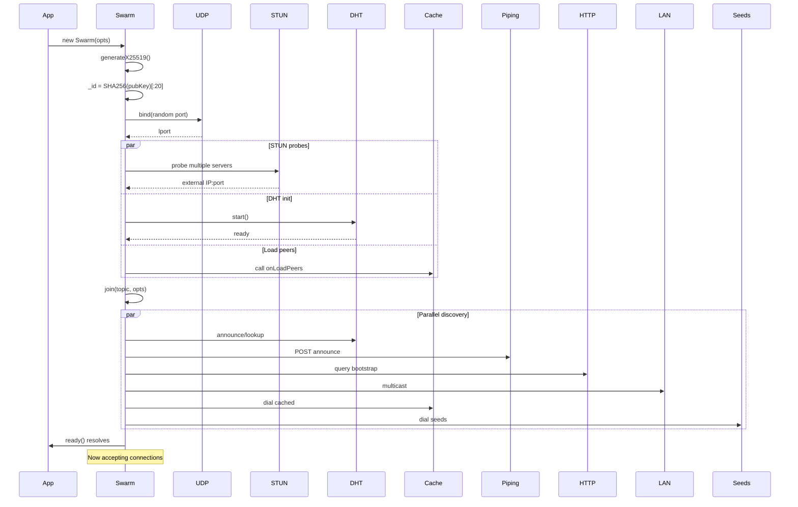

---

## 18. Security

### 18.1 Encryption

- **Key Exchange**: X25519 (255-bit elliptic curve)
- **Key Derivation**: HKDF-SHA256 (68 bytes from DH secret)
- **Symmetric**: ChaCha20-Poly1305
- **Nonce**: 12 bytes (4-byte session ID + 8-byte counter, big-endian)

### 18.2 Anti-DoS

- `maxPeers` limit (100)
- `MAX_ADDRS_PEER` (4 addresses per peer)
- Relay ban after failures
- Token bucket rate limiting

---

## 19. Error Handling

### 19.1 Connection Failures

1. Try direct connection → failure
2. Try via relay → failure
3. Ban relay after 3 failures
4. Emit `disconnect` event

### 19.2 Storage Errors

Silently ignored - data fetched from network fallback.

### 19.3 Network Errors

Socket errors caught and ignored.

---

## Appendix A: Frame Details

### A.1 HELLO (0xA1) - in constants.js? NO

```
Byte:  0       1       2-9      10-41
Data:  0xA1    [8-byte peer ID] [32-byte X25519 pub]
```

### A.2 DATA (0x01)

```
Byte:  0       1-12    13-(13+N)  (13+N)-(29+N)
Data:  0x01    [nonce] [ciphertext] [auth tag]
```

### A.3 IHAVE (0x07) - in constants.js? NO

```
Byte:  0       1-N*8    (N = number of keys)
Data:  0x07    [key hashes]
```

### A.4 PING (0x03)

```
Byte:  0       1-8     9-16
Data:  0x03    [timestamp] [peer ID]
```

---

## Appendix B: Events Not Documented Correctly

| Event | Added | Description |
|---|---|---|
| `connection` | Yes | New peer |
| `data` | Yes | Message |
| `disconnect` | Yes | Peer left |
| `sync` | Yes | Value received |
| `nat` | Yes | Pub addr known |
| `nattype` | **Added** | NAT type known |
| `peers` | **Added** | Cache emitted |
| `close` | Yes | Destroyed |

Peer events (in peer.js):

| Event | Description |
|---|---|
| `open` | Connection established |
| `data` | Data received |
| `close` | Connection closed |

---

## Appendix C: Corrections Summary

This specification corrects the following errors from previous version:

1. ~~Peer ID: 20 bytes~~ → Actually 8 bytes in HELLO frame (truncated)
2. ~~Bloom size: 64 megabits~~ → Actually 8,388,608 bits (1 MB)
3. ~~IHAVE frame~~ → Added (0x07, undocumented)
4. ~~bootstrapHttp option~~ → Added to API table
5. ~~pipingServers option~~ → Added to API table
6. ~~storeCacheMax option~~ → Added to API table
7. ~~writeCtrl method~~ → Added to Peer methods
8. ~~nattype event~~ → Added to events table
9. ~~peers event~~ → Added to events table
10. ~~Peer 'open'/'close' events~~ → Added Peer events
11. ~~All missing constants~~ → Added complete constants table

---

*End of Specification*
